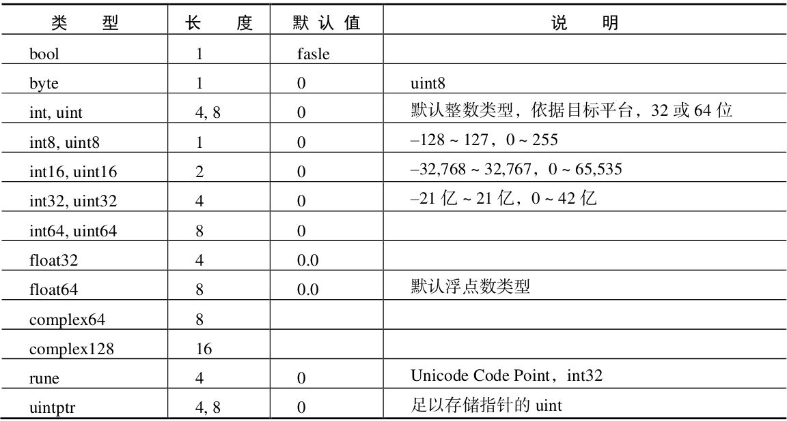
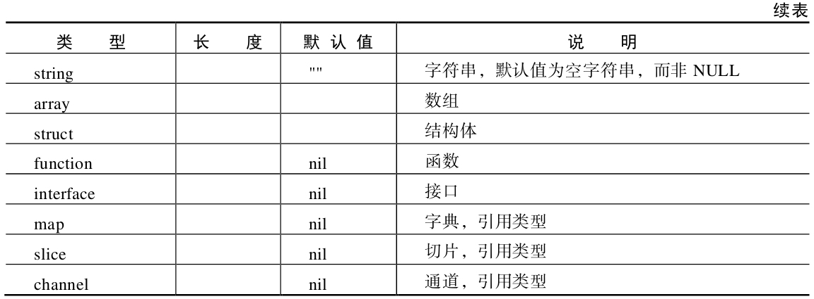

#  Go 基础

## 1 程序结构

### 1.1 基本结构

```go
package main  //以package声明开头，说 明源文件所属的包

import "fmt" //import导入依赖的包，其次为包级别的变量、常量、类型和函数的声明和赋值。

func main()  {
	//函数中可定义局部的变量、常量
	fmt.Println("Hellow Word")
}
```

### 1.2 编译

运行：
`go build -work -x -o helloworld.exe main.go`
`go run -work -x main.go`

## 2 变量

+ 变量是指对一块存储空间定义名称，通过名称对存储空间的内容进行访问或修改，使用var进行变量声明
+ 在函数中声明了变量之后必须要使用；如果在函数外声明变量可以不使用
+ 变量定义后，若没有赋值，变量会有一个零值，不同类型变量零值不同
+ 变量只能声明一次

### 2.1 变量声明

#### 2.1.1 声明变量

```go
	var me string //定义字符串类型的变量me
	me = "fan" //对变量赋值
	fmt.Println(me) //打印变量
```

#### 2.1.2 定义并赋值函数

#### 2.1.2 定义多个相同类型变量并赋值

```go
	var user, name string = "fan", "fan" //定义多个相同类型的变量
	fmt.Println(user, name )
```

#### 2.1.3 定义多个不同类型变量并赋值

**方法一：**

```go
	var (
		//定义多个不同类型变量并赋值
		age int = 20
		height float32 = 1.64
	)
```

**方法二：**

```go
	var ss, aa = "haha", 33 
```

#### 2.1.4 简短声明

+ 简短声明只能在函数内使用
+ 简短声明可以同时声明多个变量

```go
	isBoy := true //简短声明，使用时可以省略变量类型，go会推到函数类型，只能在函数内使用
	fmt.Println(isBoy)
```

#### 2.1.5 赋值

+ 可以通过赋值交换变量的值

```go
	b, bb := "b", "bb"
	b, bb =  bb, b //对变量重新赋值（讲话两个变量的值）
	fmt.Println(b, bb)
```

## 3 常量

+ 用于定义不可被修改的的值，需要在编译过程中进行计算，只能为基础的数据类型布尔、数值、字符串，使用const进行常量声明
+ 常量不能修改值
+ 常量在函数内定义时，可以不使用

### 3.1 定义常量

#### 3.1.1 定义一个常量

```go
	const Name string = "fan" //定义常量并赋值
	fmt.Println(Name)
```

#### 3.1.2 省略类型

```go
	const AGE = 10 //定义一个常量，省略常量类型
	fmt.Println(AGE)
```

#### 3.1.3 定义多个类型相同的常量

```go
	const A, B string = "A", "B" //定义多个类型相同的常量
	fmt.Println(A, B)
```

#### 3.1.4 定义多个类型不同的常量

```go
	const (
		//定义多个类型不同的常量
		C int = 1
		D string = "ss"
	)
```

#### 3.1.5 定义多个常量（省略类型）

```go
	const E, F = "EE", 22 //定义多个常量（省略类型）
	fmt.Println(E, F)
```

#### 3.1.5 定义多个常量（省略类型和值）

```go
	const (
		// 定义多个常量（省略类型和值）
		C1 int = 1
		C2
		C3
	)
	fmt.Println(C1, C2, C3)

----
运行结果:
1 1 1
```

### 3.2 枚举

+ go没有明确的枚举定义，但可以借助iota标识符实现一组自增量的值实现枚举

```go
	const (
		//枚举
		I1 int = iota
		I2
		I3
	)
	fmt.Println(I1, I2, I3)
----
运行结果:
0 1 2
```

## 4 作用域

+ 定义标识符可以使用的范围
+ 使用{}定义作用域的范围
+ 子作用域可以引用父作用域的内容；父作用域不能使用子作用域的内容

### 4.1 引用父作用域

```go
	outer :=1
	{
		fmt.Println(outer)
		//子作用域可以引用父作用域的内容；父作用域不能使用子作用域的内容
	}
```

### 4.2 重新对父作用域中存在标识符声明

```go
	inter := 2
	//声明inter
	{
		inter := 10
		//在子作用域中重新声明inter
		fmt.Println(inter)
	}
	fmt.Println(inter)
```

## 5 打印

### 5.1 格式化输出

#### 5.1.1 输出的格式

| 动 词 | 功 能                                      |
| ----- | ------------------------------------------ |
| %v    | 按值的本来值输出                           |
| %+v   | 在 %v 基础上，对结构体字段名和值进行展开   |
| %#v   | 输出 Go 语言语法格式的值                   |
| %T    | 输出 Go 语言语法格式的类型和值             |
| %%    | 输出 % 本体                                |
| %b    | 整型以二进制方式显示                       |
| %o    | 整型以八进制方式显示                       |
| %d    | 整型以十进制方式显示                       |
| %x    | 整型以十六进制方式显示                     |
| %X    | 整型以十六进制、字母大写方式显示           |
| %U    | Unicode 字符                               |
| %c    | 输出单个字符                               |
| %q    | 单引号围绕的字符字面值，由Go语法安全地转义 |
| %f    | 浮点数                                     |
| %p    | 指针，十六进制方式显示                     |
| %t    | bool类型占位符                             |

## 6 数据类型

### 6.1 bool类型

+ bool值用于表示真假
+ 标识符：bool
+ 可选择：true/false

#### 6.1.1 定义bool类型

```go
	var zero bool
	//查看bool类型的零值
	isBoy := true
	isGirl := false
	fmt.Println(zero, isBoy, isGirl)
```

#### 6.1.2 bool的操作

##### 6.1.2.1 逻辑运算

+ 与 &&， 或 || ，非 ！

##### 6.1.2.2 真值表

```go
	fmt.Println("&& 与运算")
	fmt.Println(true && true)
	fmt.Println(true && false)
	fmt.Println(false && true)
	fmt.Println(false && false)

------
运行结果：
&& 与运算
true
false
false
false
```

**（&& 与）真值表**

| X     | y     | 返回  |
| ----- | ----- | ----- |
| TRUE  | TRUE  | TRUE  |
| TRUE  | FALSE | FALSE |
| FALSE | TRUE  | FALSE |
| FALSE | FALSE | FALSE |

```go
	fmt.Println("|| 或运算")
	fmt.Println(true || true)
	fmt.Println(true || false)
	fmt.Println(false || true)
	fmt.Println(false || false)

---
运行结果
|| 或运算
true
true
true
false
```

**（|| 或）真值表**

| X     | Y     | 返回  |
| ----- | ----- | ----- |
| TRUE  | TRUE  | TRUE  |
| TRUE  | FALSE | TRUE  |
| FALSE | TRUE  | TRUE  |
| FALSE | FALSE | FALSE |

```go
	fmt.Println("! 取反")
	fmt.Println(!true)
	fmt.Println(!false)
```

**（!非）真值表**

| 非   | X     | 返回  |
| ---- | ----- | ----- |
| !    | TRUE  | FALSE |
| !    | FALSE | TRUE  |

#### 6.1.2.2 关系运算(==、!=)

```go
	isBoy := true
	isGirl := false
	fmt.Println(isBoy == isGirl)
	fmt.Println(isBoy != isGirl)
```

### 6.2 数值类型

#### 6.2.1 整型





##### 6.2.1.1 定义整型变量

```go
	var age int = 20
	fmt.Printf("%T %d\n", age, age)
	fmt.Println(0777) //八进制
	fmt.Println(0x10) //十六进制
----
运行结果：
int 20
511
16
```

##### 6.2.1.2 算数运算

+ 运算符：：+、-、*、/、%、++、--
+ ++ 和 -- 所操作的对象必须是变量，且必须在变量后面

```go
	var age int = 20

	fmt.Println(1 + 2)
	fmt.Println(2 - 1)
	fmt.Println(1 * 3)
	fmt.Println(9 / 2)
	fmt.Println(9 % 2)

	age ++ //自增
	fmt.Println(age)
	age -- //自减
	fmt.Println(age)

---
运行结果：
3
1
3
4
1
21
20
```

##### 6.2.1.3 关系运算

+ 运算符：  >、>=、<、<=、==、!=

```go
	fmt.Println(2 > 4)
	fmt.Println(1 < 3)
	fmt.Println(2 >= 2)
	fmt.Println(2 <= 3)
	fmt.Println(2 == 2)
	fmt.Println(1 != 3)

---
运行结果：
false
true
true
true
true
true
```

##### 6.2.1.4 位运算

+ 运算符：&、|、^、<<、>>、&^

##### 6.2.1.5 赋值运算

+ 赋值运算符：=、+=、-=、*=、/=、%=、&=、|=、^=、<<=、>>=

```go
	age = 10
	age += 3 // age  = age + 3
	fmt.Println(age)
	age -= 3 // age = age - 3
	fmt.Println(age)
	age *= 2 // age = age * 2
	fmt.Println(age)
	age %= 2 // age = age % 2
	fmt.Println(age)
	age /= 3 // age = age / 3
	fmt.Println(age)

---运行结果：
13
10
20
0
0   
```

6.2.1.6 类型转换

+ 不同类型间不能直接运算，需要进行类型转换
+ 从大往小转时，可能会导致溢出

```
	fmt.Println(intA + int(uintB)) //强制类型转换，将uint类型转换成int类型
	fmt.Println(uint(intA) + uintB) //强制类型转换，将int类型转换成uint类型
```

##### 6.2.1.7  rune 和 byte

###### 6.2.1.7.1 定义

```go
	//byte, rune
	var a byte = 'A'
	var b rune = '中'
	fmt.Println(a, b)

---
运行结果：
65 20013
```

###### 6.2.1.7.2 [] rune 和 [] byte 区别

**go源码中的定义：**

```go
// byte is an alias for uint8 and is equivalent to uint8 in all ways. It is
// used, by convention, to distinguish byte values from 8-bit unsigned
// integer values.
type byte = uint8

// rune is an alias for int32 and is equivalent to int32 in all ways. It is
// used, by convention, to distinguish character values from integer values.
type rune = int32
```

#### 6.2.2 浮点数


